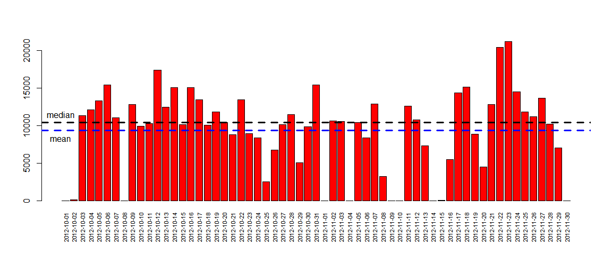
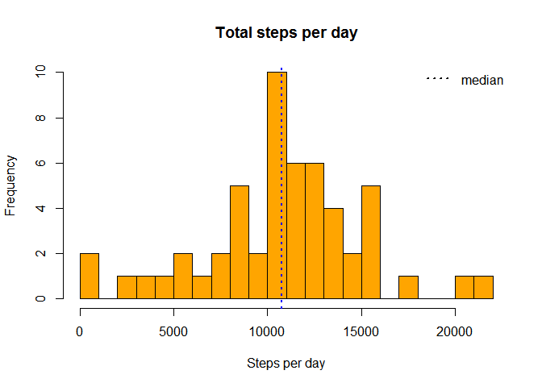
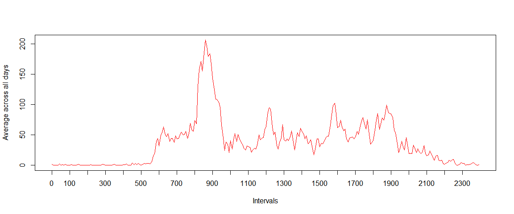
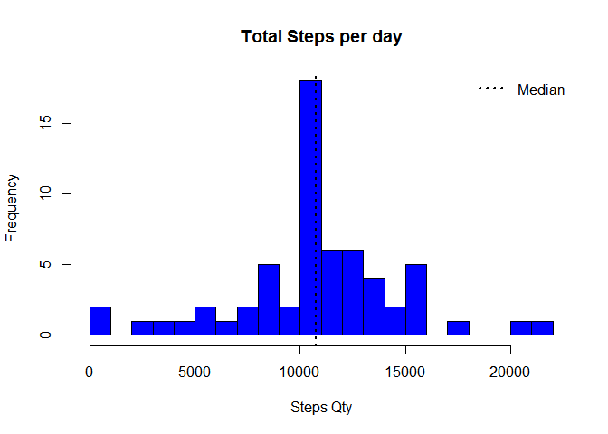
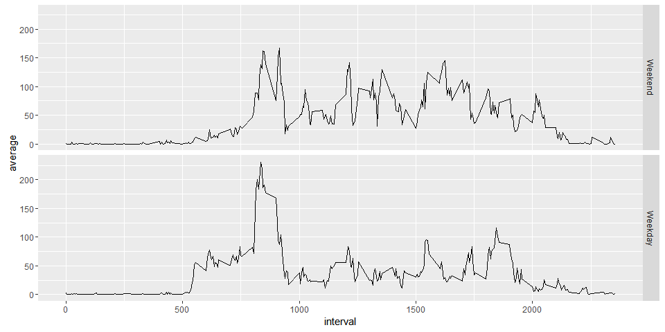

# Reproducible Research: Peer Assessment 1


## Loading and preprocessing the data
First, unzip the source file in your Working Directory.


```r
unzip("activity.zip",exdir = "data")
```
Read the source csv file (activity) into  data frame and show some rows.

```r
activity <- read.csv("data/activity.csv", stringsAsFactors=FALSE)
str(activity)
```

```
## 'data.frame':	17568 obs. of  3 variables:
##  $ steps   : int  NA NA NA NA NA NA NA NA NA NA ...
##  $ date    : chr  "2012-10-01" "2012-10-01" "2012-10-01" "2012-10-01" ...
##  $ interval: int  0 5 10 15 20 25 30 35 40 45 ...
```

Convert variable date to a Date format using lubridate package. Install this package if you don't have it.


```r
if(!require(lubridate)){
    install.packages("lubridate")
    library(lubridate)
}
activity$date <- ymd(activity$date)

str(activity)
```

```
## 'data.frame':	17568 obs. of  3 variables:
##  $ steps   : int  NA NA NA NA NA NA NA NA NA NA ...
##  $ date    : POSIXct, format: "2012-10-01" "2012-10-01" ...
##  $ interval: int  0 5 10 15 20 25 30 35 40 45 ...
```


## What is the average daily activity pattern?
#### 1. Calculate the total number of steps taken per day (ignore the missing values)

```r
if(!require(dplyr)){
    install.packages("dplyr")
    library(dplyr)
}
total_day <- activity %>% group_by(date) %>%summarise(total_steps=sum(steps,na.rm=TRUE),na=mean(is.na(steps))) %>% print
```

```
## Source: local data frame [61 x 3]
## 
##          date total_steps    na
##        (time)       (int) (dbl)
## 1  2012-10-01           0     1
## 2  2012-10-02         126     0
## 3  2012-10-03       11352     0
## 4  2012-10-04       12116     0
## 5  2012-10-05       13294     0
## 6  2012-10-06       15420     0
## 7  2012-10-07       11015     0
## 8  2012-10-08           0     1
## 9  2012-10-09       12811     0
## 10 2012-10-10        9900     0
## ..        ...         ...   ...
```
Visualise the total number of steps taken per day as a barplot (Package "dplyr" is needed.)


```r
barplot(height = total_day$total_steps,names.arg=total_day$date,cex.names=0.68,las=3,col="red")
abline(h=median(total_day$total_steps), lty=2,lwd=3, col="black")
abline(h=mean(total_day$total_steps), lty=2,lwd=3, col="blue")
text(x = 0,y=median(total_day$total_steps),pos=3,labels = "median")
text(x = 0,y=mean(total_day$total_steps),pos=1,labels = "mean",col="black")
```



####  2. Make a histogram of the total number of steps taken each day

Days with missing observations does not appear in a Histogram.  

```r
total_day <- filter(total_day, na < 1)
hist(total_day$total_steps,col="orange",breaks=20,main="Total steps per day",xlab="Steps per day")
abline(v=median(total_day$total_steps),lty=3, lwd=2, col="blue")
legend(legend="median","topright",lty=3,lwd=2,bty = "n")
```



#### 3. Calculate and report the mean and median of the total number of steps taken per day


```r
#Mean
mean_steps <- mean(total_day$total_steps,na.rm=TRUE)
#Median
median_steps <- median(total_day$total_steps,na.rm=TRUE)
```
Mean and median of the total number of steps taken per day are 1.076619\times 10^{4} steps and 10765 steps, respectively.

## What is the average daily activity pattern?

#### 1. Make a time series plot (i.e. type = "l") of the 5-minute interval (x-axis) and the average number of steps taken, averaged across all days (y-axis)  


```r
#Installation of dplyr was already done before.
library(dplyr,quietly = TRUE)
daily_patterns <- activity %>% group_by(interval) %>% summarise(average=mean(steps,na.rm=TRUE))
plot(x = 1:nrow(daily_patterns),y = daily_patterns$average,type = "l",
     col = "red", xaxt = "n",xlab="Intervals", 
     ylab = "Average across all days")
axis(1,labels=daily_patterns$interval[seq(1,288,12)],
     at = seq_along(daily_patterns$interval)[seq(1,288,12)])
```



#### 2. Which 5-minute interval, on average across all the days in the dataset, contains the maximum number of steps?

```r
max_numb_steps_interval <- filter(daily_patterns,average==max(average))
```

Interval **"835"** contains on average the maximum number of steps (**206.17 steps**).

## Imputing missing values

#### 1. Calculate and report the total number of missing values in the dataset (i.e. the total number of rows with NAs)


```r
na_number <- sum(is.na(activity$steps))
na_number
```

```
## [1] 2304
```

```r
percentage_na <- mean(is.na(activity$steps))
percentage_na
```

```
## [1] 0.1311475
```
Total number of missing values in the dataset amounts to **2304 ** (what is **13.1** % of total observations).

#### 2. Devise a strategy for filling in all of the missing values in the dataset

As the number of missing values in this dataset is fairly large, we cannot be sure if there is no bias introduced by missing values. Therefore we impute missing values based on average number of steps in particular 5-minutes interval. 

#### 3. Create a new dataset that is equal to the original dataset but with the missing data filled in.

```r
without_NAs <- numeric(nrow(activity))
for (i in 1:nrow(activity))
{
        if (is.na(activity[i,"steps"])==TRUE)
            {
                    without_NAs[i]<-filter(daily_patterns,interval==activity[i,"interval"]) %>% select(average)
            } 
        else
            {
                    without_NAs[i]<-activity[i,"steps"]
            }
                    
}
activity_without_NAs<-mutate(activity,steps_no_NAs=without_NAs)
head(activity_without_NAs)
```

```
##   steps       date interval steps_no_NAs
## 1    NA 2012-10-01        0     1.716981
## 2    NA 2012-10-01        5    0.3396226
## 3    NA 2012-10-01       10    0.1320755
## 4    NA 2012-10-01       15    0.1509434
## 5    NA 2012-10-01       20    0.0754717
## 6    NA 2012-10-01       25      2.09434
```

Impact of NAs   

```r
check <- filter(activity_without_NAs,!is.na(steps)) %>% mutate(ok = (steps==steps_no_NAs))
mean(check$ok)
```

```
## [1] 1
```

#### 4. Make a histogram of the total number of steps taken each day and Calculate and report the mean and median total number of steps taken per day


```r
total_day_noNAs <- activity_without_NAs %>% mutate(steps_no_NAs=as.numeric(steps_no_NAs)) %>% group_by(date) %>% summarise(total_steps=sum(steps_no_NAs))
hist(total_day_noNAs$total_steps,col="blue",breaks=20,main="Total steps per day",xlab="Steps per day")
abline(v=median(total_day$total_steps),lty=3, lwd=2, col="black")
legend(legend="median","topright",lty=3,lwd=2,bty = "n")
```




```r
summary(total_day_noNAs$total_steps)
```

```
##    Min. 1st Qu.  Median    Mean 3rd Qu.    Max. 
##      41    9819   10770   10770   12810   21190
```

Including NAs should affect the final results, our mean increased its value while median decreased.
Missing values always affect mean & median. (Note: Don't confuse a missing value with a zero value)

## Are there differences in activity patterns between weekdays and weekends?

#### 1. Create a new factor variable in the dataset with two levels - "weekday" and "weekend" indicating whether a given date is a weekday or weekend day


```r
#Installation of dplyr was already done before.
library(lubridate)
is_weekday <-function(date){
        if(wday(date)%in%c(1,7)) result<-"weekend"
        else
                result<-"weekday"
        result
}

activity_without_NAs <- mutate(activity_without_NAs,date=ymd(date)) %>% mutate(day=sapply(date,is_weekday))

table(activity_without_NAs$day)
```

```
## 
## weekday weekend 
##   12960    4608
```

#### 2. Make a panel plot containing a time series plot (i.e. type = "l") of the 5-minute interval (x-axis) and the average number of steps taken, averaged across all weekday days or weekend days (y-axis)


```r
library(ggplot2)
daily_patterns <- activity_without_NAs %>% mutate(day=factor(day,levels=c("weekend","weekday")),steps_no_NAs=as.numeric(steps_no_NAs)) %>% group_by(interval,day) %>% summarise(average=mean(steps_no_NAs))
qplot(interval,average,data=daily_patterns,geom="line",facets=day~.)
```


